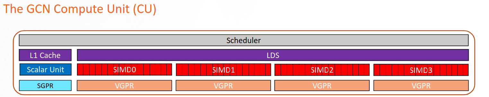

# Register Pressure in AMD GPUs #

The following blog post is focused on a practical demo showing how to apply the recommendations explained in the following [talk](https://vimeo.com/742349001) presented as an
OLCF training talk on August 23rd 2022. Here is a [link](https://docs.olcf.ornl.gov/training/training_archive.html) to the training archive where you can also find the slides
presented during the talk.

In this blog post, we will focus on the AMD CDNA2 architecture (MI200 series cards).

## Registers and Occupancy ##

General purpose registers are the fastest type of memory available in modern processors. In most cases, the ALUs (Arithmetic Logic Units) in traditional processor and accelerators can only directly access registers.
Unfortunately, registers are a scarse and expensive resource and compilers try their best to *optimize* the way logical variables are assigned to hardware registers to be manipulated by the ALU.

When we use the word *optimize* we should always clarify the objective of the optimization process. In fact, regular CPUs and accelerators (like GPUs), because of their very nature, have different ways of executing programs and achieving high performance.
Traditional CPUs are latency-oriented machines, designed to execute as many instructions as possible belonging to a single serial thread. On the other hand, GPUs are throughput-oriented machines, designed to take advantage
of parallelism between independent threads as much as possible.

In AMD GPUs, a high number of concurrent wavefronts running on the same Compute Unit (CU) allows the GPU to hide the time spent in accessing global memory (higher than the time needed to perform a compute operation) with other operations performed by other threads.

The term *occupancy* represents the maximum number of wavefronts that can run on the same CU potentialy at the same time. In general, having higher occupancy provides better performance by hiding costly memory accesses with other operations, but this is not always the case.

Ideally, we would like to have as much occupancy as possible, all the time. In reality, occupancy is limited by hardware design choices and resource limitations dictated by the shader code / kernel (HIP, OpenCL, etc.) running on the card.
For example, each CU of the AMD CDNA2 cards has four sets of wavefront slots, each of which can manage at the most **eight** wavefronts. This means that the physical limit to occupancy in CDNA2 is 32 wavefronts per CU.

The number of registers needed by a kernel is one of the most relevant factors deciding occupancy (another factor is the amount of LDS memory used).
The following table summarizes the maximum level of occupancy achievable on CDNA2 cards as a function of the number of VGPRs used by a kernel.

